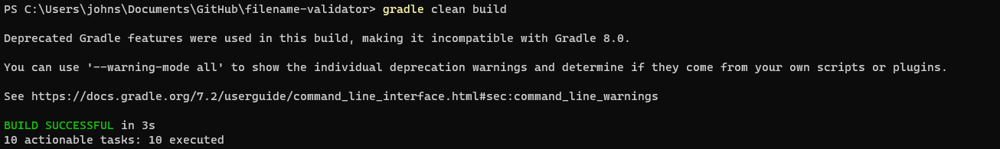
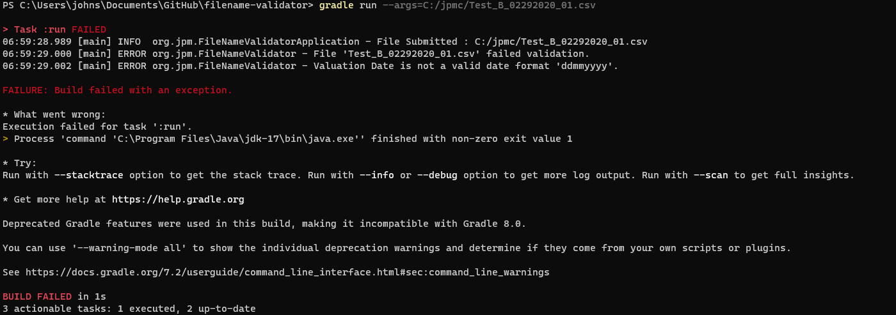
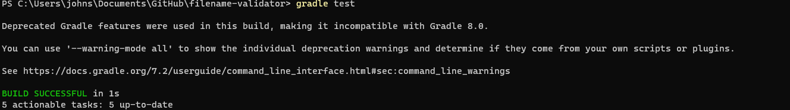
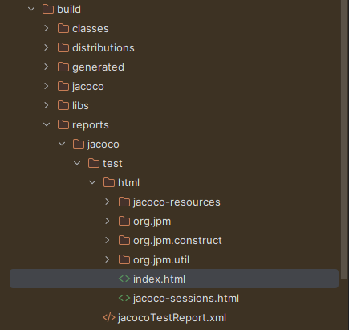
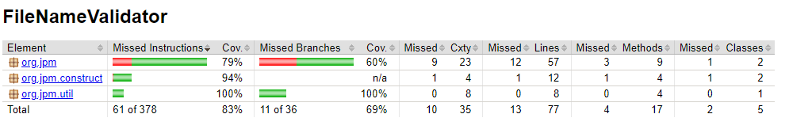

# File Name Validator
    
## Overview
    
This Java program is designed to validate file names based on specific criteria. It checks if a given file name follows the expected format and provides information on whether the file passed or failed validation.

### Assumptions

- The file name format should be : `Test_<portfoliocode>_<ddmmyyyy>_<2digit-sequencenumber>.csv`
- The portfolio code is case-sensitive and can be one of: A, B, C.
- The valuation date should follow the format 'ddmmyyyy'.
- The sequence number should be between 01 and 99 (inclusive).
- The file is placed under a windows system in the path C:/jpmc

### Scenarios

- The program will print whether the file passed or failed validation.
- If the file fails validation, it will provide details about the failure, such as incorrect portfolio code, date format, or an invalid sequence number.

## Usage

### Prerequisites
    
- Java Development Kit (JDK 17) installed on your machine.
- Gradle 7.2 installed on your machine.
- Build and Execution would be managed by Gradle.
- jacoco for code coverage
- Sonarqube used for code quality and security.
    
### 1. Clone the Repository
    
Clone this repository to your local machine using the following command:

    git clone https://github.com/John1187/filename-validator.git
    
Switch to branch : Release/R2309
    
### 2. Compilation and Execution

To compile and execute the program, use the following Gradle commands:

#### Build

    cd filename-validator
    gradle clean build

#### Execute

    gradle run --args=<file_location>

Replace <file_location> with the location of the file you want to validate. Example:

    gradle run --args=C:/jpmc/Test_B_02292020_01.csv

### 3. Testing

To run the JUnit tests, use the following Gradle command:

    gradle test

#### Test Cases

- Test_A_01012022_01.csv
- Test_A_07121987_01.csv
- Test_B_12122021_99.csv
- Test_C_07052023_42.csv
- Test_E_07121987_03.csv
- Test_A_07121987.txt
- Test_A_07121987_04.txt 
- InvalidPrefix_A_01012022_01.csv 
- Test_X_01012022_01.csv
- Test_A_12345_01.csv
- Test_A_01012022_123.csv
- Test_A_01012022.csv
- Test_A_0101202201.csv
- Test_A_31132022_01.csv
- Test_B_02292020_01.csv
### 4. Code Coverage Reports

    gradle jacocoTestReport

The reports would be generated in the folder structure below

### 5. Enhancements

**Batch Processing:** Allow users to validate multiple files in batch mode by providing a list of file locations in a text file.

**Integration with File Handling:** Integrate file handling functionality to automate common tasks such as moving valid files to a different directory or archiving invalid files.

**Configurability:** Allow users to configure validation rules externally, possibly using a configuration file, so that the validation criteria can be changed without modifying the code.

**Concurrency:** Make the program capable of handling multiple file validations concurrently for improved performance.

**Locale-Specific Date Validation:** Allow for different date formats based on the user's locale. This can be helpful in international applications.

**Custom Exception Handling:** Create custom exception classes to handle specific validation errors. This provides more detailed error messages and better separation of concerns.

